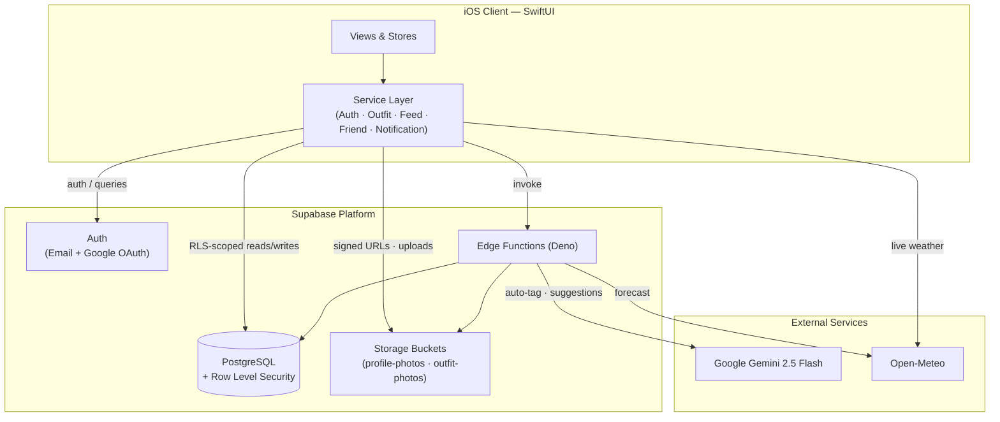
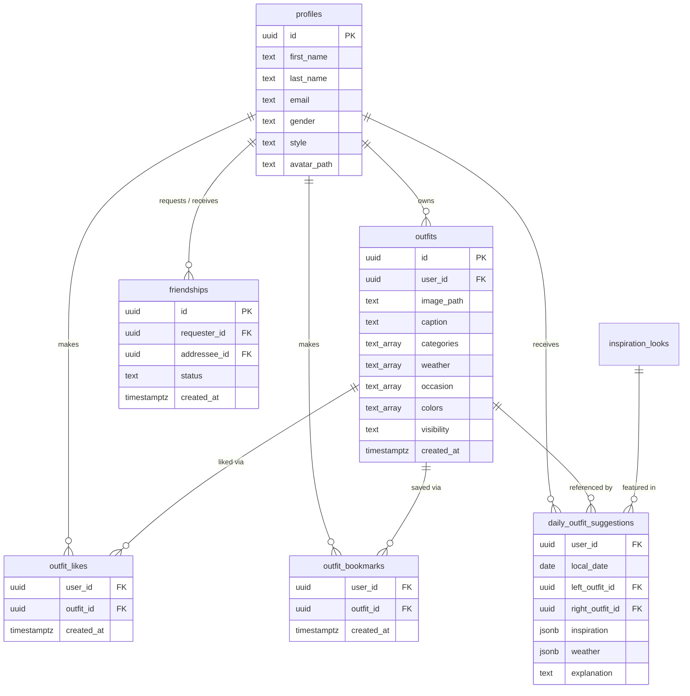
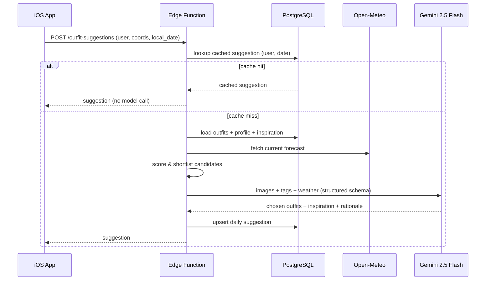

# Fitty

> An AI-powered iOS fashion companion that turns a user's wardrobe into a searchable digital closet and generates daily, weather-aware outfit recommendations.

Fitty (internal project name **DripLog**) is a full-stack iOS social fashion application. Users photograph their outfits to build a digital closet, have each piece automatically tagged by a vision model, and receive personalized daily outfit suggestions grounded in live local weather, their stored wardrobe, and a curated inspiration catalog. A social layer adds follows, a multi-scope feed, likes, bookmarks, and activity notifications.

The application is built on a **SwiftUI** client, a **Supabase** (PostgreSQL + Auth + Storage) backend, and **Deno/TypeScript edge functions** that orchestrate **Google Gemini** for multimodal reasoning.

**Author:** [fyrebolt](https://github.com/fyrebolt)

---

## Table of Contents

- [Architecture](#architecture)
- [Feature Overview](#feature-overview)
- [Technology Stack](#technology-stack)
- [Data Model](#data-model)
- [AI Suggestion Pipeline](#ai-suggestion-pipeline)
- [Security & Privacy](#security--privacy)
- [Project Structure](#project-structure)
- [Getting Started](#getting-started)
  - [iOS Client](#ios-client)
  - [Supabase Backend](#supabase-backend)
- [Engineering Notes](#engineering-notes)
- [Roadmap](#roadmap)

---

## Architecture

Fitty is organized into three tiers: a SwiftUI client, a Supabase managed backend, and serverless edge functions that broker access to external AI and weather providers. The client never holds AI provider credentials — all model calls are proxied through authenticated edge functions.



---

## Feature Overview

### Authentication & Accounts
- Email/password sign-up and login with client-side validation
- Google OAuth via `ASWebAuthenticationSession` and a `fitty://` redirect scheme
- Automatic session restoration on launch
- Editable account details and profile photo (resized, uploaded, served via signed URL)

### Guided Onboarding
A coordinated multi-step flow that captures everything the recommendation engine needs before the user reaches the main app:
- Introductory slides
- Style preference capture (gender + style direction)
- Profile photo plus a required set of five wardrobe photos
- Optional per-photo tag review

Onboarding completion is gated on successful media uploads rather than optional tag confirmation, so a user always finishes with a populated closet.

### Digital Closet & Tagging
- In-app camera capture and photo-library import
- A media pipeline that normalizes orientation, resizes, and compresses images before upload, with retry-and-backoff on transient network failures
- On-device person segmentation (Apple **Vision** `VNGeneratePersonSegmentationRequest`) for subject cutouts
- Structured metadata per outfit: `categories`, `weather`, `occasion`, `colors`, free-form custom tags, and a visibility level
- A reusable accordion-and-chip tag editor shared across upload and post-upload editing

### AI Auto-Tagging
Each outfit image is sent to the `auto-tag-outfit` edge function, which prompts Gemini against a **fixed taxonomy** and returns structured JSON. The function then **re-validates every returned value against the server-side allow-lists**, discarding anything off-taxonomy. This keeps tags consistent and reliably filterable across the entire app.

### AI Outfit Suggestions
A daily recommendation that pairs two outfits from the user's closet with a matching inspiration look and a written rationale. The pipeline combines deterministic pre-ranking, multimodal model reasoning, and per-user daily caching — see [AI Suggestion Pipeline](#ai-suggestion-pipeline).

### Social Feed & Interactions
- Multi-scope feed: **Recent**, **Friends Only**, and **Saved**
- Follow / unfollow relationships
- Like / unlike and bookmark / unbookmark, enforced at the data layer
- Pagination and pull-to-refresh

### Friends
- User search
- Follow and follow-back flows
- Incoming-request visibility
- Friend profile detail screens

### Activity Notifications
An in-app notification center that aggregates two event types — likes on the user's outfits and new followers — resolving actor profiles and thumbnails, and supporting one-tap follow-back.

### First-Run Tutorial
A stateful overlay system that anchors coach marks to live UI using SwiftUI preference keys, walking new users through AI tags, dropdown tagging, the closet grid, the generate-outfit call to action, and the feed.

---

## Technology Stack

| Layer | Technologies |
| --- | --- |
| **Client** | Swift 5, SwiftUI, UIKit interop, Swift Concurrency (`async/await`, task groups), `PhotosUI`, `AVFoundation` (camera), `CoreLocation`, Apple `Vision` |
| **State** | `@State`, `@StateObject`, `@ObservedObject`, `@EnvironmentObject`, `@AppStorage`; protocol-based service layer |
| **Backend** | Supabase Auth, Supabase PostgreSQL, Supabase Storage, Supabase Edge Functions (Deno / TypeScript) |
| **AI & APIs** | Google Gemini `gemini-2.5-flash` (auto-tagging + outfit reasoning), Open-Meteo (live forecast) |
| **Tooling** | Swift Package Manager (`supabase-swift`), Supabase CLI, Xcode |

---

## Data Model

The schema is defined by SQL migrations under `supabase/migrations/`. Row Level Security is enabled on every user-facing table, and storage objects are folder-scoped to the owning user's ID. (The `profiles` table is provisioned at the Supabase project level and extended by these migrations.)



---

## AI Suggestion Pipeline

The `outfit-suggestions` edge function is the most involved part of the system. It is deliberately structured so the language model only performs the work it is uniquely good at — visual reasoning and explanation — while everything deterministic happens in code.

1. **Cache check.** Suggestions are keyed by `(user_id, local_date)`. A cached result for the current local date is returned immediately, avoiding redundant model calls.
2. **Candidate gathering.** The function loads the user's outfits and a gender-filtered slice of the inspiration catalog in parallel, and fetches the current forecast from Open-Meteo.
3. **Deterministic shortlist.** Outfits and inspiration looks are scored against today's weather tags and the user's own tag vocabulary, then trimmed to a small shortlist and lightly shuffled within the top band for day-to-day variety.
4. **Multimodal reasoning.** Shortlisted outfit images are downloaded, base64-encoded, and sent to Gemini with a structured `responseSchema`. The model selects two outfits and one inspiration look and writes a short rationale that references specific visible garments.
5. **Resilient parsing.** Responses are parsed defensively — with brace-extraction recovery and a fully deterministic fallback selection — so a malformed model response never produces a failed request.
6. **Persist & return.** The final suggestion is upserted into `daily_outfit_suggestions` and returned to the client.



---

## Security & Privacy

- **Row Level Security** is enabled on profiles, outfits, friendships, likes, bookmarks, and daily suggestions. Policies are defined alongside the tables they protect.
- **Visibility model.** Outfits carry a visibility level (`private`, `friends`, `public`). Feed queries and database policies are aligned so visibility is enforced at the data layer, not just in the UI.
- **Scoped storage.** Uploaded media lives in user-ID-prefixed folders; storage policies restrict write access to the owning user.
- **Signed URLs.** Image access uses time-limited signed URLs, with Supabase image transforms used to request appropriately sized thumbnails.
- **Credential isolation.** AI provider keys live only in edge-function secrets; the client authenticates to functions with its Supabase session token.

Relevant migrations:
- `supabase/migrations/20260513000000_profiles_rls.sql`
- `supabase/migrations/20260514001000_outfit_access.sql`
- `supabase/migrations/20260526000000_feed_visibility_bookmarks.sql`

---

## Project Structure

```text
DripLog/
  Frontend/
    AuthView.swift, AuthViewModel.swift     # Authentication UI + view model
    ContentView.swift, DripLogApp.swift      # App entry & root composition
    Onboarding/                              # Multi-step onboarding flow
    Outfit/                                  # Upload & edit tagging screens
    Tagging/                                 # Reusable tag editor, chips, AI button
    Camera/                                  # AVFoundation capture stack
    Closet/                                  # Visibility, filters
    Suggestions/                             # Daily suggestion UI + image cache
    Tabs/                                    # Home / Create / Profile tabs
    Tutorial/                                # Coach-mark overlay system
    Stores/, Navigation/, Theme/             # Shared state, tab bar, styling
  Backend/
    AuthService.swift                        # Auth, profile, preferences
    OutfitService.swift                      # Closet, auto-tag, suggestions, weather
    FeedService.swift                        # Multi-scope feed, likes, bookmarks
    FriendService.swift                      # Search, follow graph
    NotificationService.swift                # Likes + follow activity
    SupabaseClientProvider.swift             # Client + configuration
supabase/
  migrations/                                # Schema, RLS, storage policies
  functions/
    auto-tag-outfit/                         # Vision tagging (constrained taxonomy)
    outfit-suggestions/                      # Daily recommendation pipeline
Config/
  Local.xcconfig.example                     # Signing & key template
```

---

## Getting Started

### iOS Client

**Prerequisites**
- macOS with Xcode (the project currently targets iOS 26.2 in build settings)
- An Apple Developer team for device signing
- A Supabase project if running against your own backend

**1. Clone**
```bash
git clone https://github.com/fyrebolt/DripLog.git
cd DripLog
```

**2. Configure local signing**
```bash
cp Config/Local.xcconfig.example Config/Local.xcconfig
```
Set `DEVELOPMENT_TEAM` and `APP_BUNDLE_ID` in the new file.

**3. Configure Supabase keys**

The client reads `SUPABASE_URL` and `SUPABASE_ANON_KEY` via Info.plist build settings. In the target's build settings, set:
- `INFOPLIST_KEY_SUPABASE_URL`
- `INFOPLIST_KEY_SUPABASE_ANON_KEY`

**4. Configure Google OAuth (optional)**

Add `fitty://` as a redirect URI in Supabase Auth. The `fitty` URL scheme is already declared in the app's Info.plist.

**5. Run**

Open `DripLog.xcodeproj`, select the `DripLog` scheme, and build to a simulator or device.

### Supabase Backend

**Prerequisites**
- [Supabase CLI](https://supabase.com/docs/guides/cli)
- Docker (for the local Supabase runtime)

**1. Start Supabase and apply the schema**
```bash
supabase start
supabase db reset   # applies everything in supabase/migrations/
```

**2. Set function secrets**
```bash
supabase secrets set GEMINI_API_KEY=your_gemini_key
```
`SUPABASE_URL` and `SUPABASE_ANON_KEY` are provided by the runtime.

**3. Deploy edge functions**
```bash
supabase functions deploy auto-tag-outfit
supabase functions deploy outfit-suggestions
```

**4. Point the client at this project**

Update the client's `SUPABASE_URL` / `SUPABASE_ANON_KEY` to match the target project.

---

## Engineering Notes

- **Clear separation of concerns.** Every backend capability sits behind a Swift protocol (`AuthServicing`, `OutfitServicing`, `SuggestionServicing`, `AutoTagServicing`, `FeedServicing`, `NotificationServicing`), keeping views thin and the service layer independently testable and swappable.
- **AI used with guardrails.** Model output is constrained by fixed taxonomies and `responseSchema`, re-validated server-side, and backed by deterministic fallbacks so a bad model response degrades gracefully instead of failing.
- **Performance-conscious media handling.** Images are normalized, resized, and compressed before upload; thumbnails are requested via Supabase transforms; and a custom image cache avoids redundant downloads in suggestion cards.
- **Cost-aware AI.** Per-user, per-day suggestion caching and deterministic pre-ranking minimize how often — and how much context — the language model is invoked.
- **Resilient networking.** Uploads retry transient failures with backoff, and signed-URL generation falls back to per-item resolution when batch signing fails.

---

## Roadmap

- Unit and UI test coverage for the service layer and onboarding flow
- CI for linting, build, and migration verification
- Push notification delivery to complement the existing in-app activity center
- Onboarding-conversion analytics and experimentation hooks
- Screenshots and recorded demos embedded in this README
</content>
</invoke>
